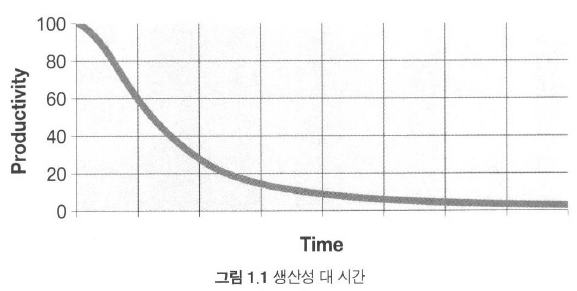

# 1. 깨끗한 코드

---

### 코드

- 코드란 궁극적으로 요구 사항을 표현하는 언어이자 수단이다.
- 코드는 엄밀하고 정확하고 상세하며 정형화 되어야 한다.

### 나쁜 코드

- 나쁜 코드는 쓰레기 더미처럼 점점 쌓이기 마련이다.
- 나쁜 코드가 쌓일수록 생산성이 떨어진다.
    
    
    

> leblanc’s Law(르블랑의 법칙) : 나쁜 코드를 구현하면 나중은 오지 않는다.
> 

### 깨끗한 코드

- 깨끗한 코드는 잘 쓴 문장처럼 읽혀야 한다.
- 깨끗한 코드는 **다른** 사람이 고치기 쉽다.
- 깨끗한 코드는 시간을 들여 깔끔하고 단정하게 정리한 코드다.
- 깨끗한 코드는 읽으면서 짐작이 가능하다.

- [ ]  중복을 피하기
- [ ]  한 기능만 수행하기
- [ ]  표현력 높이기
- [ ]  간단히 추상화 하기

# 2. 의미 있는 이름

---

### 의도를 분명히 밝히기

<aside>
💡 분명한 이름이 제일 중요하다!

</aside>

```java
### 나쁜 코드
public List<int[]> getThem() {
	List<int[]> list1 = new ArrayList<int[]>();
	for (int [] x : theList)
		if(x[0] == 4)
			list1.add(x);
		return list1;
}
```

```java
### 깨끗한 코드
public List<Cell> getFlaggedCells() {
	List<Cell> flaggedCells = new ArrayList<Cell>();
	for (Cell cell : gameBoard)
		if(cell.isFlagged())
			flaggedCells.add(cell);
	return flaggedCells
}
```

### 깨끗한 코드를 작성하기 위한 원칙

- 불용어 사용을 피하기
    
    → 불용어 : 분석에 큰 의미가 없는 단어 ex) the, a, an
    
- 발음하기 쉬운 이름을 사용하기
- 검색이 쉬운 이름을 사용하기
    
    → 이름 길이는 범위 크기에 비례!
    
- 접두어를 피하기
