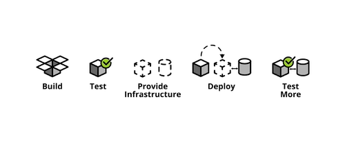
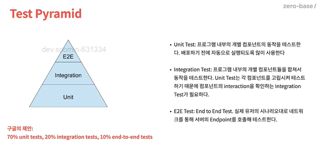
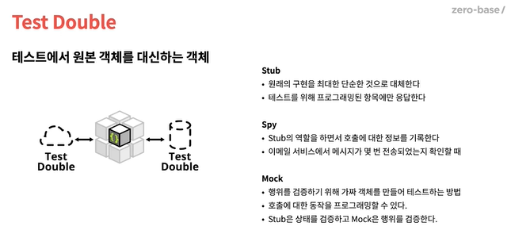
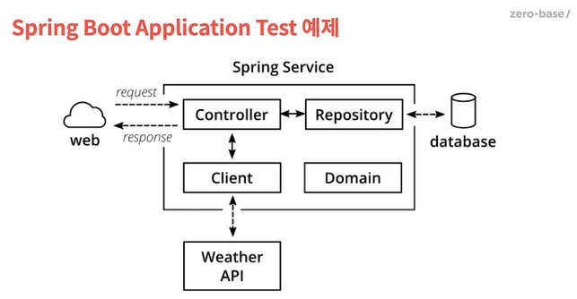

# CHAPTER 09 단위 테스트

## 테스트코드의 중요성

- 테스트 코드는 실수를 바로 잡아 준다.
- 테스트 코드는 반드시 존재해야 하며, 실제 코드 못지않게 중요하다
- 테스트 케이스는 변경이 쉽도록, 코드에 유연성, 유지 보수성, 재 사용성을 제공하는 버팀목이 바로 단위 테스트
- 테스트 케이스가 없다면 모든 변경이 잠정적인 버그. 테스트 커버리지가 높을수록 버그에 대한 공포가 줄어든다.
- 지저분한 테스트 코드는 테스트를 안하니만 못하다.
- 테스트는 자동화 되어야 한다
- 


## 테스트의 종류

- 테스트 피라미드



## Unit Test 작성

- 테스트 라이브러리를 작성하자
- JUnit5 + mockito 를 많이 사용한다.
- Test Double



- given-when-then 패턴을 사용하자

```java
public void testGetPageHierarchyAsXml() {
	givenPages("PageOne", "PageOne.ChildOne", "PageTwo");
	whenRequestIsIssued("root", "type:pages");
	thenResponseShouldBeXML();
}

public void testGetPageHierarchyHasRightTags() throws Exception {
	givenPages("PageOne", "PageOne.ChildOne", "PageTwo");
	whenRequestIsIssued("root", "type:pages");
	thenResponseShouldContain(
		"<name>PageOne</name>", "<name>PageTwo</name>", "<name>ChildOne</name>"
	);
}
```

- given : 테스트에 대한 pre-condition
- when : 테스트하고 싶은 동작 호출
- then : 테스트 결과 확인



## FIRST 원칙

- 유닛테스트를 작성하기 위한 5가지 원칙
- Fast : 테스트는 빠르게 돌아야한다. 자주 돌리기 때문
- Independent : 테스트는 독립적으로 작성한다. 서로에게 의존하면 실패한 원인을 찾기 어려워진다.
- Repeatable : 반복가능하게, 어떤 환경에서도 반복 가능해야한다. 실제환경,QA환경
- Self-Validating : 자가 검증하는, 테스트는 bool 값으로 결과를 내야한다.
- Timely: 적시에, 테스트하려는 실제 코드를 구현하기 직전에 구현한다.

## 오픈소스 속 Unit Test

- JUnit5 가 테스트에 관한 유용한 기능들을 많이 가지고 있기 때문에 실무에서 많이 사용된다.