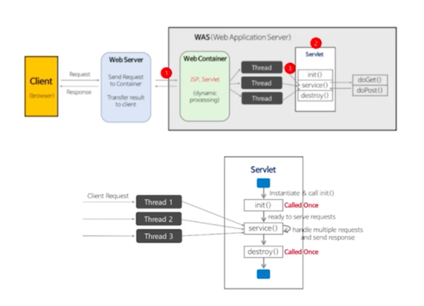
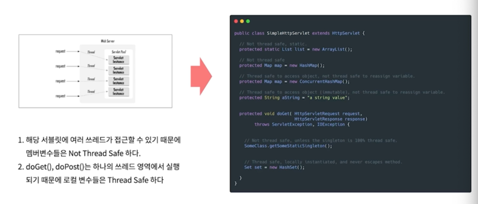

# CHAPTER 13 동시성

## 동시성 프로그래밍이란
> 어플리케이션을 효율적으로 실행하기 위해 멀티코어를 온전히 활용하도록 구현하는 방식
- 외부 서비스의 응답을 기다리면서 아무일도 하지 않으면 CPU 사이클이 낭비된다.
- 동시성을 구현한다고 해서 클라이언트 입장에서 자신의 요청이 빨리 처리되는게 아니다.
- 어플리케이션 입장에서는 효율적으로 코어를 사용하여 처리량을 높일 수 있다.
- 언어레벨에서 하드웨어의 멀티코어를 적절하게 사용하도록 지원하기 때문에 동시성만 신경써서 개발하면 된다.
- 동시성과 병렬성이 구현된 경우 서버(코어)를 효율적으로 사용하여 처리량을 최대화
- 클라이언트가 아닌 어플리케이션 관점에서의 효율성을 높여야 한다. 

## 동시성이 필요한 이유
> 동시성은 항상 성능을 높여주는 것이 아닌, 때로 성능을 높여준다.
### 자바 서블릿 동시성 구현

- 요청이 들어오면 Thread Pool에 있는 Thread 가 서블릿의 service() 메서드를 호출한다.
- service 의 doGet(), doPost() 에서 요청에 대한 처리를 하도록 구현한다.
> 동시성을 구현하면 설계를 바꾸어야 한다.
> 컨테이너를 사용해도 동시성을 이해해야 한다.

## 안전한 동시성 프로그래밍 규칙
### 단일 책임 원칙 설계
> 동시성 관련 코드는 다른 코드와 분리하라
### 자료 범위를 제한하라
> 공유 자료를 최대한 줄여라
- 동시 수정 문제를 피하기 위해 객체를 사용하는 코드 내 임계영역을 syncronized 키워드로 보호하라.
- 보호할 임계영역을 빼먹거나, 모든 임계영역을 보호했는지 확인하느라 수고가 드므로 임계영역의 수를 최소화 해야한다.
### 자료 사본을 사용하라
>공유 자료를 줄이려면, 최대한 공유하지 않는 방법이 제일 좋다.
- 객체를 복사해 읽기 전용으로 사용한다.
- 각 스레드가 객체를 복사해 사용한 후 스레드가 해당 사본에서 결과를 가져온다.
- 사본을 사용하는 방식으로 내부 잠금을 없애 수행 시간을 절약하는 것이 사본 생성과 가비지 컬렉션에 드는 부하를 상쇄할 가능성이 크다.
### 스레드는 가능한 독립적으로 구현하라.
> 다른스레드와 자료를 공유하지 않는다.
- 서블릿처럼 각 스레드는 클라이언트 요청 하나를 처리한다.
- 모든 정보는 비공유 출처에서 가져오며 로컬 변수에 저장한다.
- 각 서블릿은 마치 자신이 독자적인 시스템에서 동작하는 양 요청을 처리한다.

## 동시성 테스트 방법

## 오픈소스 속 동시성 처리
