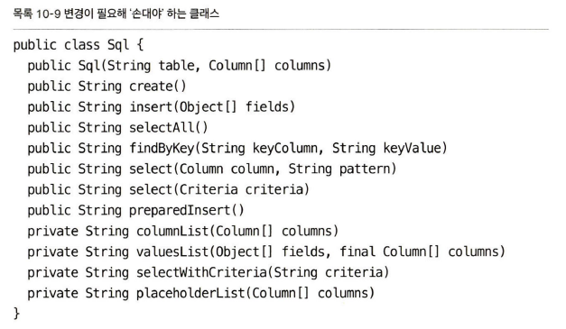
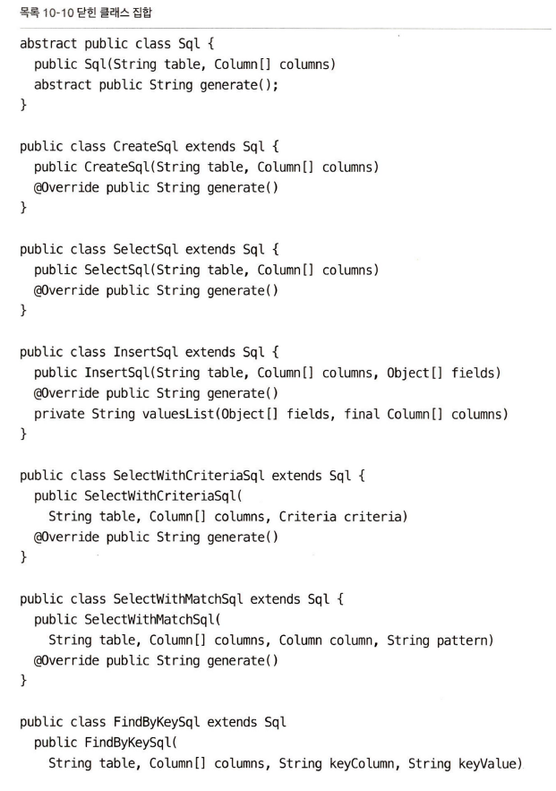
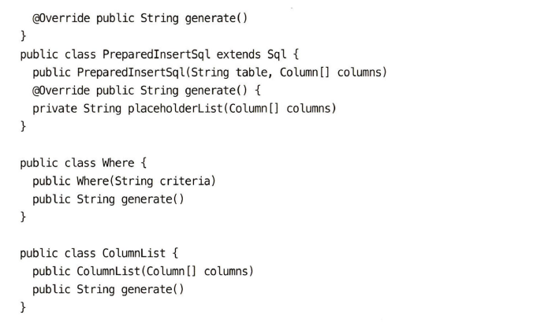

## 클래스 체계
1. 변수 목록
- public static(정적 공개) 변수
- private static(정적 비공개) 변수
- private 인스턴스 변수
- public 변수 (거의 없다)
2. public 함수
3. private 함수 - 호출하는 함수 직후에

###  캡슐화
갭슐화를 풀어주는 결정은 언제나 최후의 수단이다.

##  클래스는 작아야한다.
클래스가 맡은 책임이 작아야한다.  
= 클래스 이름이 모호하거나, 간결(25자 이내)하게 생각나지 않는다면 큰 것이다.  

### 단일 책임 원칙(SRP, Single Responsibility Principle)
큰 클래스 몇개보다 작은 클래스 여러개로 나눠지는 것이 낫다.  
작은 클래스는 각자 맡은 책임이 하나며, 변경할 이유가 하나며, 다른 작은 클래스와 협력해 시스템에 필요한 동작을 수행한다.

### 응집도
응집도가 높은 클래스가 선호된다.  
응집도가 높다 : 메서드가 선언된 변수를 많이 사용한다 = 클래스에 속한 메서드와 변수가 논리적인 단위로 묶인다는 의미

### 응집도를 유지하면 작은 클래스 여러개가 나온다
'함수를 작게, 매개변수 목록을 짧게'  
큰 함수를 쪼개고 싶을 때, 공동으로 사용하는 변수가 많다면, 인스턴스 변수로 승격한다.  
-> 함수를 쪼개기 쉬워진다.  
-> 클래스가 응집력을 잃는다.  
-> 응집력이 높아지도록 독자적인 클래스로 분리한다.  

## 변경하기 쉬운 클래스
클래스가 크면, 코드를 수정하기위해서 건들이는 범위가 넓어진다.  


### 변경으로부터의 격리
- 구체적인 클래스 : 구현이 바뀌면 변경이 위험하다. 외부 API가 변경될 경우  테스트 클래스를 짜기 쉽지 않다.
- 추상 클래스(feat. 인터페이스) : 테스트 클래스를 만들기 쉽다.

```java
public interface StockExchange {
	Mony currentPrice(String symbol);
}
public JapenStockExchange implements StockExchange {
	// 여기서 TokyoStockExchange API를 사용
}
public TestStockExchange implements StockExchange {
	// API TokyoStockExchange 클래스를 흉내내는 테스트용 클래스를 만들 수 있음
}
public Portfolio {
	private StockExchange exchange;
	public Portfolio(StockExchange exchange){
		this.exchange = exchange;
	}
	// ...
}
```


### 예제
before refactoring  
  
after refactoring  
  
  
(모든 파생클래스가 공통으로 사용하는 비공개 메서드는 유틸리티 클래스로 만들어 묶었다)